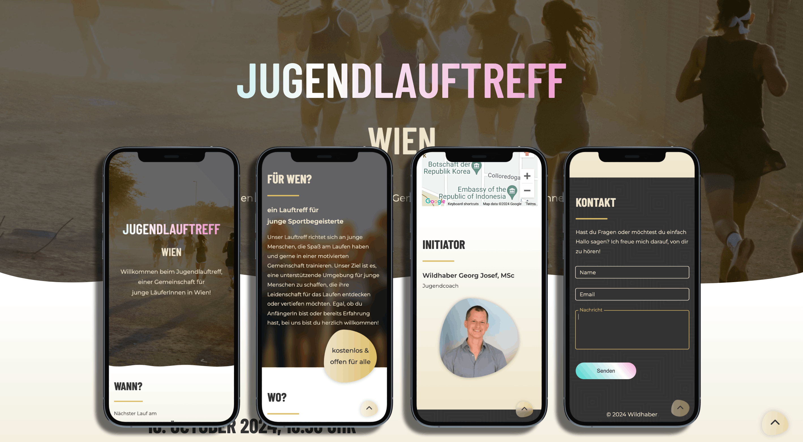

  ## To the project online
<!--  -->

[jugendlauftreff-wien.at](https://jugendlauftreff-wien.at/)

## Table of Contents

- [About Project](#about-project)
- [Built With](#built-with)
- [File Structure](#file-structure)
  - [HTML Files](#html-files)
  - [PHP Files](#php-files)
  - [JavaScript Files](#javascript-files)
  - [SCSS Files](#scss-files)
  - [Database](#database)
- [External Services](#external-services)

## About Project

The Jugendlauftreff project is a simple website designed to engage young runners in Vienna. It includes various features such as displaying upcoming running events, a contact form, and Google Maps integration to show the meeting point.\
Admins can update the next running event date through an admin page.

The project is built using HTML, CSS, JavaScript, PHP, and integrates external services like Google Maps and Formspree for form handling. The front-end is deployed on Netlify.

## Built With

    
    
    
    
    
    
    

## File Structure

### HTML Files

**index.html**\
_/index.html_

This is the main page of the website. It includes:

- Header section introducing the Jugendlauftreff with a gradient-animated title.

- Sections for displaying the upcoming event date, target audience, meeting location (Türkenschanzpark), and information about the event initiator.

- Footer section with a contact form.

**change-date.html**\
_/change-date.html_

A simple admin page to update the date for the next running event.

- It includes a form with a date picker that submits the new date to the backend.

### PHP Files

**run-date.php**\
_/run-date.php_

This script fetches the latest running event date from the database and outputs it as a response. The date is displayed on the main page.

**set-date.php**\
_/set-date.php_

This script handles the admin's date update request. It receives the new date via POST, sanitizes the input, and stores it in the database.

**db_connection.php**\
_/db_connection.php_

This file establishes a connection to the MySQL database. It ensures the server allows access from specific origins (CORS) and handles potential connection errors.

### JavaScript Files

**ajax.js**\
_/js/ajax.js_

Handles AJAX requests for fetching and updating the running event date.

- getDate()

  - Fetches the current date from the server and formats it for display.

- setDate()
  - Submits a new date to the server for updating.

**contact_form.js**\
_/js/contact_form.js_

Manages the submission of the contact form using the Formspree service. It handles form data, sends it to the server, and provides feedback to the user based on the response.

**scrollAnimation.js**\
_/js/scrollAnimation.js_

Adds scroll-triggered animations to various sections of the page, making the content appear with smooth animations as the user scrolls.

**script.js**\
_/js/script.js_

Manages general interactivity on the website, such as showing the "back to top" button when the user scrolls down the page and handling animations for the button.

**map.js**\
_/js/map.js_

Initializes a Google Map with the location of the running event's meeting point at Türkenschanzpark.

### SCSS Files

**\_variables.scss**\
_*/style/\_variables.scss*_

Defines global variables such as colors, fonts, and media breakpoints.

**\_media.scss**\
_*/style/\_media.scss*_

Handles responsive design, specifically for smaller screens.

**\_utilities.scss**\
_*/style/\_utilities.scss*_

Provides reusable utility classes and animations like `.container`, `.bottom-line`, and `.gradient-animation`.

**style.scss**\
_*/style/style.scss*_

Main stylesheet that imports variables and utilities, and applies global styles.

### Database

The project uses a MySQL database with the following structure:

- Table: `run_date`
  - id: Primary key (auto-increment).
  - DATE: Stores the date and time of the next running event.

## External Services

- **Google Maps API**

  - The map showing the event meeting point at Türkenschanzpark is initialized via Google Maps API in map.js

- **Formspree**

  - Handles contact form submissions.

- **Netlify**

  - Hosts the front-end of the website.
